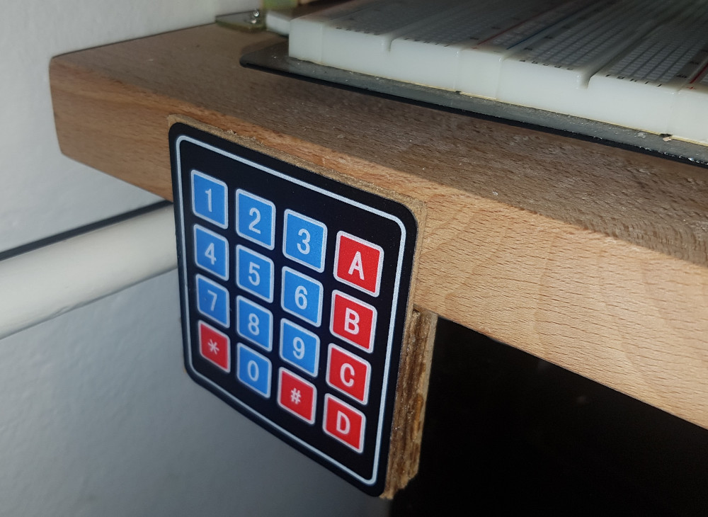

# KVM Switch

Switching HDMI and USB between multiple computers using keypad to allow work with multiple computers simultaneously.

### Implementation

Used:
 * Arduino pro micro (5V, 16Mhz, ATMEGA32u4)
 * 2x PremiumCord HDMI switch 3:1
 * MAX232 compatible IC
 * ATEN USB switch 4:1
 * 4x4 matrix keyboard

### Keyboard

Simplest matrix keyboard was used and positioned on the edge of the table.

